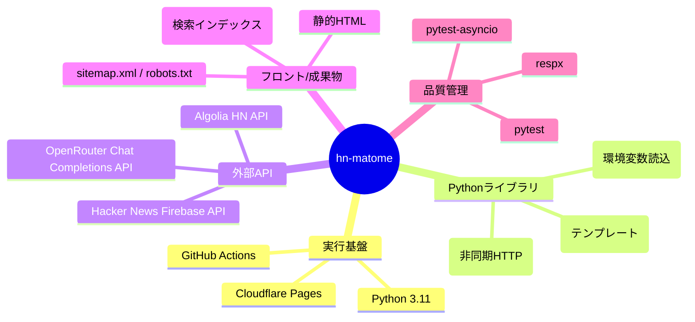
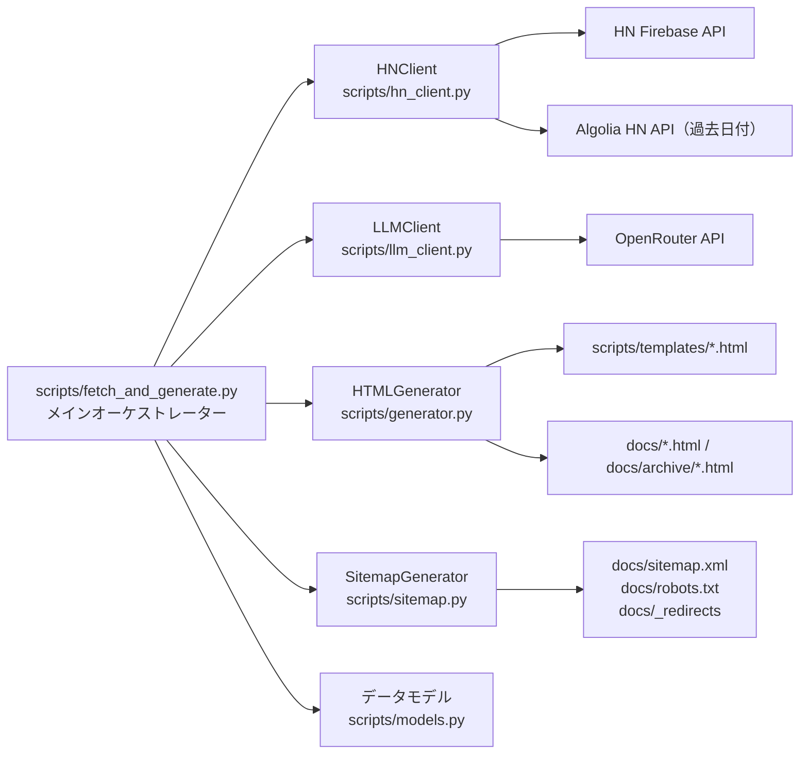
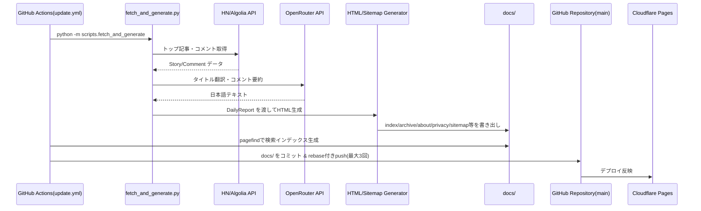
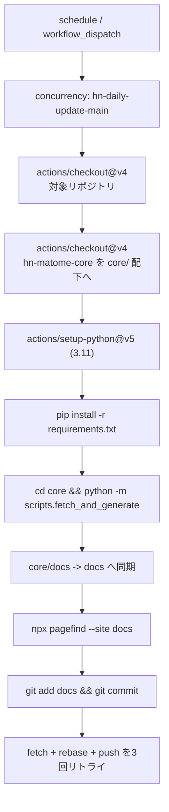
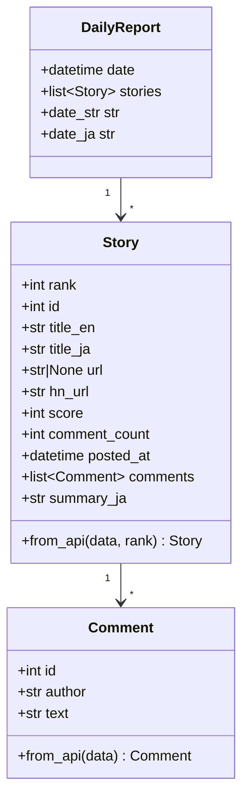
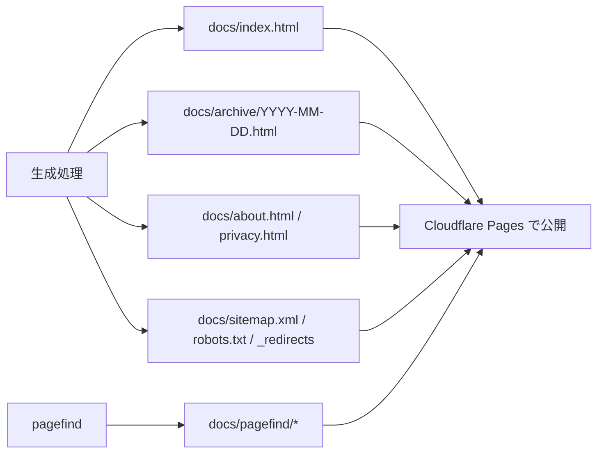

# hn-matome 実装技術と構成の可視化

このドキュメントは、現在の実装を「使用技術」「アプリ構成」「データフロー」「運用フロー」の観点で、Mermaid 図で把握するためのものです。

## 1) 使用技術スタック

## 2) アプリケーション構成（モジュール関係）

## 3) 日次バッチのデータフロー

## 4) GitHub Actions ワークフロー構成

## 5) データモデル（実装ベース）

## 6) 生成物と公開構成

---

必要なら次の追加もできます。
- 「core リポジトリ」と「このリポジトリ」の責務分離図
- エラー時フォールバック（翻訳失敗時の英語タイトル利用など）の状態遷移図
- テスト観点マップ（どのテストがどのモジュールを担保しているか）
